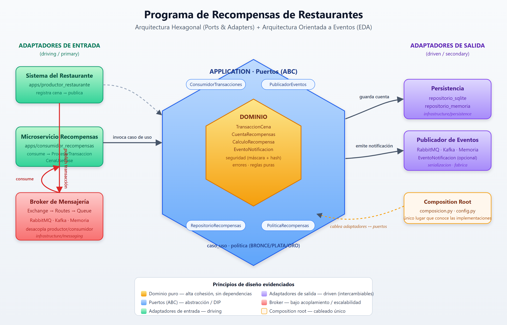
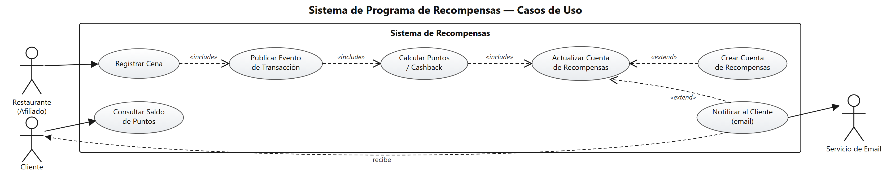
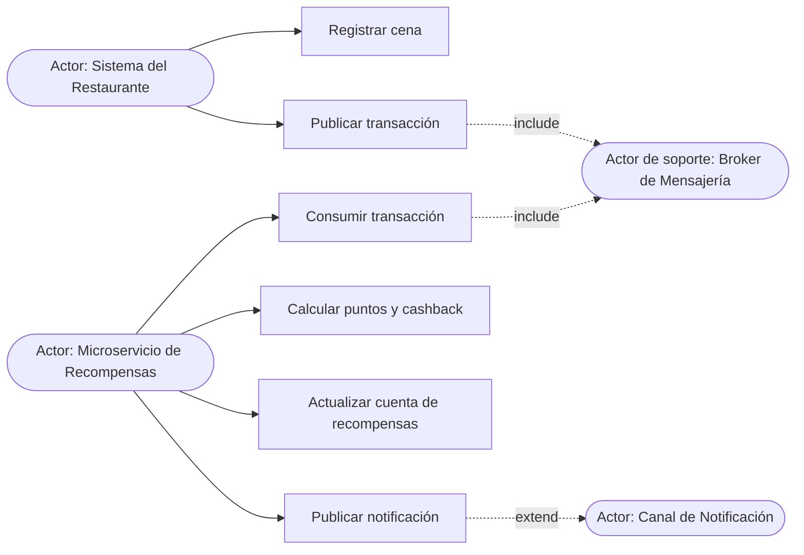
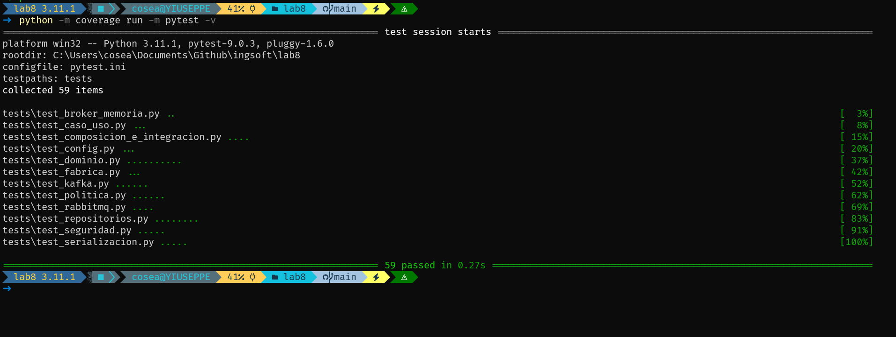
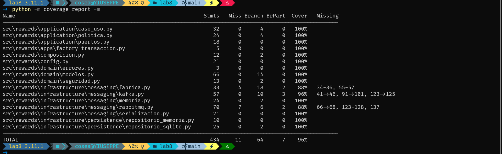

# Programa de Recompensas de Restaurantes — Arquitectura Orientada a Eventos

Tarea 8 — CS3081 Ingeniería de Software · *Buen diseño: Cohesión y Acoplamiento*.

Solución de software para un **programa de fidelización de restaurantes**: cuando un
cliente cena en un restaurante afiliado, el restaurante publica la transacción en un
**broker de mensajería**; un **microservicio de recompensas** la consume, calcula los
puntos y el *cashback*, actualiza la cuenta del cliente y emite (opcionalmente) un
evento de notificación.

## Enlaces del proyecto

- **Repositorio (GitHub):** <https://github.com/JosephAnderson234/Lab8-IngSoft>
- **Análisis de calidad (SonarQube):** <https://sonarqube.ingsoftware.lat/dashboard?id=Joseph_Cose_t1&codeScope=overall>

---

## 1. Patrón arquitectónico: Arquitectura Hexagonal (Ports & Adapters)

Se eligió **Arquitectura Hexagonal** combinada con un enfoque **orientado a eventos
(EDA)**. El núcleo de negocio no conoce ninguna tecnología concreta: depende solo de
*puertos* (interfaces). Las tecnologías (RabbitMQ, Kafka, SQLite, memoria) son
*adaptadores* intercambiables.




### Cómo se evidencian los atributos pedidos

| Atributo | Cómo se logra |
|---|---|
| **Alta cohesión** | Cada módulo tiene una sola responsabilidad: `politica.py` solo calcula recompensas, `serializacion.py` solo (de)serializa, cada adaptador solo habla con su tecnología. |
| **Bajo acoplamiento** | La aplicación depende de **abstracciones** (`puertos.py`), no de `pika`/`confluent_kafka`/`sqlite3`. El *composition root* es el único punto que conoce las implementaciones. |
| **Modularidad** | Capas separadas: `domain/`, `application/`, `infrastructure/`, `apps/`. |
| **Abstracción** | `PoliticaRecompensas`, `RepositorioRecompensas`, `PublicadorEventos`, `ConsumidorTransacciones` son interfaces (ABC). |
| **Escalabilidad** | El broker desacopla productor y consumidor; se pueden ejecutar N consumidores. RabbitMQ usa colas durables + `basic_qos`; Kafka usa `group.id`. |
| **Inversión de dependencias** | Las dependencias externas se importan de forma **perezosa**; cambiar de broker no toca la lógica. |

---

## 2. Diagrama de Casos de Uso



<details>
<summary>Versión equivalente en Mermaid</summary>



</details>

**Actores:** Sistema del Restaurante (productor), Microservicio de Recompensas
(consumidor), Broker de Mensajería (RabbitMQ/Kafka) y el Canal de Notificación.

**Flujo principal:** Registrar cena → Publicar transacción → *(broker)* → Consumir
transacción → Calcular recompensa → Actualizar cuenta → *(opcional)* Publicar
notificación.

---

## 3. Estructura del proyecto

```
src/rewards/
├── domain/                 # Núcleo puro (sin dependencias externas)
│   ├── modelos.py          # TransaccionCena, CuentaRecompensas, CalculoRecompensa...
│   ├── seguridad.py        # Enmascarado de tarjeta + id de cuenta (hash)
│   └── errores.py          # Jerarquía de errores de dominio
├── application/            # Orquestación
│   ├── puertos.py          # Interfaces (ABC): los "ports"
│   ├── politica.py         # Regla de negocio: puntos/cashback por nivel
│   └── caso_uso.py         # ProcesarTransaccionCena
├── infrastructure/         # Adaptadores
│   ├── messaging/          # memoria · rabbitmq · kafka · serialización · fábrica
│   └── persistence/        # repositorio en memoria · repositorio SQLite
├── config.py               # Configuración desde variables de entorno
├── composicion.py          # Composition root (cableado)
└── apps/                   # Entrypoints: productor_restaurante, consumidor_recompensas
tests/                      # 59 pruebas (cobertura 96%)
```

---

## 4. Cómo reproducir el proyecto

**Requisitos:** Python **3.11+** y `git`. Todo se ejecuta dentro de un **entorno
virtual (virtualenv)** para aislar las dependencias del sistema.

### 4.1 Clonar el repositorio

```bash
git clone https://github.com/JosephAnderson234/Lab8-IngSoft.git
cd Lab8-IngSoft
```

### 4.2 Crear y activar el entorno virtual

**Windows (PowerShell):**

```powershell
python -m venv .venv
.\.venv\Scripts\Activate.ps1
python -m pip install --upgrade pip
pip install -r requirements-dev.txt
```

> Si PowerShell bloquea la activación, ejecuta antes:
> `Set-ExecutionPolicy -Scope Process RemoteSigned`.

**Linux / macOS (bash):**

```bash
python3 -m venv .venv
source .venv/bin/activate
python -m pip install --upgrade pip
pip install -r requirements-dev.txt
```

> `requirements-dev.txt` instala las dependencias de ejecución (`requirements.txt`)
> **más** las de calidad (`pytest`, `coverage`). El núcleo y las pruebas **no**
> necesitan `pika` ni `confluent-kafka`: los adaptadores los importan de forma
> perezosa y el flujo completo se prueba con el broker en memoria.
>
> El prompt mostrará `(.venv)` cuando el entorno esté activo. Para salir: `deactivate`.

### 4.3 Ejecutar pruebas y cobertura

```bash
python -m coverage run -m pytest
python -m coverage report -m
python -m coverage xml          # genera coverage.xml para Sonar
```

### 4.4 Demo con broker real (RabbitMQ)

Crea tu archivo `.env` a partir de la plantilla y complétalo con los datos de tu
broker (el `.env` real **nunca** se versiona; está en `.gitignore`):

```powershell
Copy-Item .env.example .env      # Windows
# cp .env.example .env           # Linux / macOS
```

Luego, con el entorno virtual activo:

```bash
# Terminal 1 — microservicio de recompensas (consumidor)
python -m rewards.apps.consumidor_recompensas
# Terminal 2 — restaurante publica una cena de 150.00
python -m rewards.apps.productor_restaurante 150.00 4111111111111111 REST-001
```

Para usar Kafka basta con `BROKER_TIPO=kafka` y `BROKER_PUERTO=9092` en el `.env`
(sin tocar una sola línea de la lógica de negocio).

---

## 5. Evidencia de ejecución de pruebas automatizadas

### 5.1 Ejecución de la suite (`pytest`)

```bash
python -m coverage run -m pytest -v
```



- Entorno: **Python 3.11.1**, `pytest 9.0.3`, `pluggy 1.6.0` (Windows), configuración en `pytest.ini`.
- Se recolectaron y ejecutaron **59 pruebas** y **todas pasaron** (`59 passed in 0.27s`), sin fallos ni omisiones.
- Abarcan los 13 módulos de prueba: dominio, política, caso de uso, configuración, fábrica de brokers, serialización, seguridad, repositorios (memoria/SQLite), los tres adaptadores de mensajería (memoria, RabbitMQ, Kafka) y la composición/integración de extremo a extremo.

### 5.2 Reporte de cobertura por módulo (`coverage report -m`)

```bash
python -m coverage report -m
```



- **Cobertura total: 96 %** (434 sentencias, 11 sin cubrir; 64 ramas, 7 parciales), por encima del mínimo exigido del **85 %**.
- El **núcleo de negocio está al 100 %**: todo `domain/` (modelos, seguridad, errores) y `application/` (caso_uso, politica, puertos), además de `config.py` y `composicion.py`.
- Las pocas líneas sin cubrir están solo en adaptadores de infraestructura que dependen de un broker real: `messaging/fabrica.py` (88 %), `messaging/rabbitmq.py` (88 %) y `messaging/kafka.py` (96 %); corresponden a ramas de conexión y manejo de errores de red que no se ejercitan con el broker en memoria.

---

## 6. Calidad (SonarQube)

```bash
sonar-scanner -Dsonar.token=TU_TOKEN
```

- **Dashboard público:** <https://sonarqube.ingsoftware.lat/dashboard?id=Joseph_Cose_t1&codeScope=overall>
- `sonar.projectKey=Joseph_Cose_t1`
- Cobertura reportada vía `coverage.xml` (**96%**, mínimo exigido 85%).
- **Seguridad:** no hay credenciales en el código; se leen de variables de entorno.
  El número de tarjeta nunca se almacena/transmite completo (enmascarado + hash).
- **Duplicación:** la (de)serialización y la conexión a cada broker están
  centralizadas para no repetir lógica entre adaptadores.

---

## 7. Regla de negocio (política de recompensas)

| Nivel | Umbral de consumo | Cashback | Puntos |
|---|---|---|---|
| BRONCE | < 100 | 2% | parte entera del monto |
| PLATA | 100 – 299 | 3% | parte entera del monto |
| ORO | ≥ 300 | 5% | parte entera del monto |

Los umbrales y porcentajes son **configurables** vía el constructor de
`PoliticaRecompensasEstandar`, por lo que cambiar la regla no afecta al resto.
